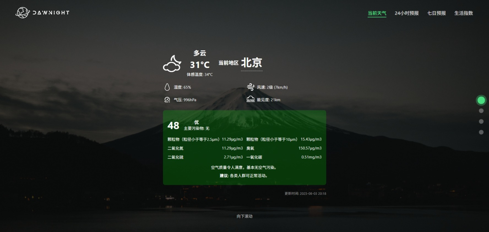
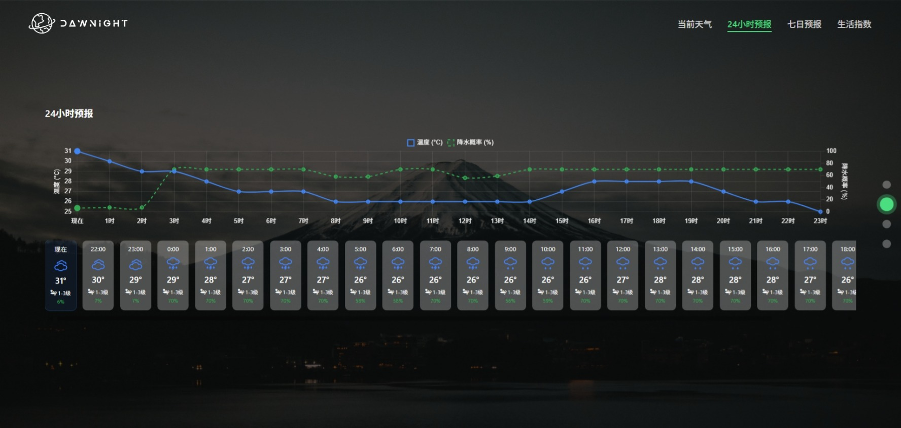
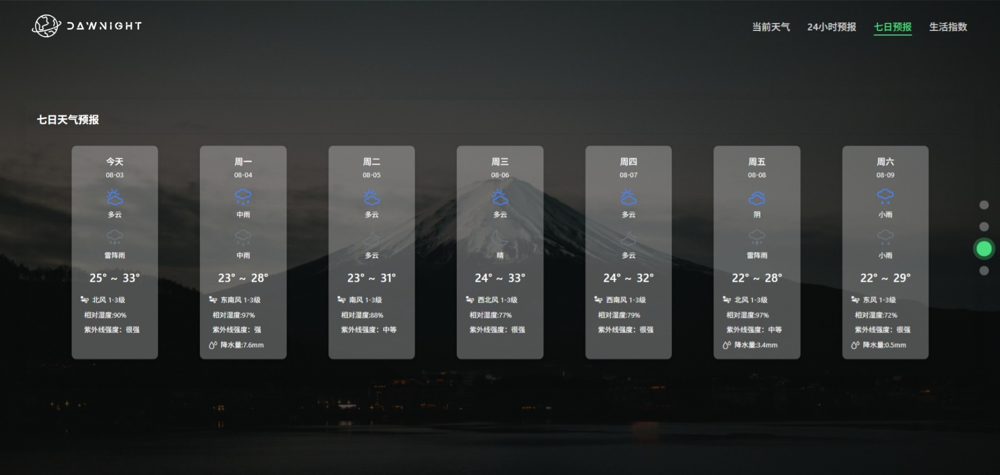
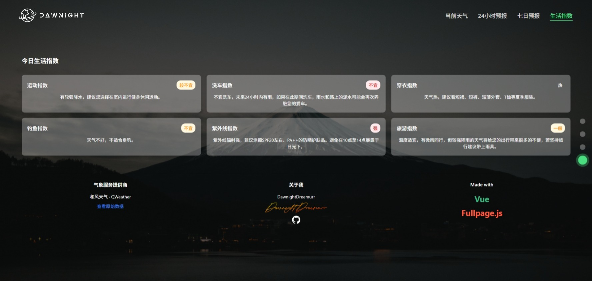

# Weather Forecast Application 天气预报应用


A full-stack weather application built with Node.js backend and Vue 3 + Vite + Pinia frontend, providing weather forecasts for Chinese cities.

一个基于Node.js后端和Vue 3 + Vite + Pinia前端构建的全栈天气应用，提供中国城市的天气预报。

## Features 功能特点

- Current weather conditions 当前天气状况
- 24-hour weather forecast 24小时天气预报
- 7-day weather forecast 7天天气预报
- Living indices (UV, humidity, etc.) 生活指数（紫外线、湿度等）
- City search 城市搜索


## Screenshots 截图

<div align="center">
  
  
  
  
</div>

## Prerequisites 环境准备

- Node.js (v16 or higher)
- npm (v8 or higher)
- API keys from [QWeather](https://dev.qweather.com/) (和风天气API密钥)

## Installation 安装

### Backend Setup 后端设置

1. Navigate to the backend directory 进入后端目录:
   ```bash
   cd Dawnight_back
   ```

2. Create a `config.env` file with the following content 创建config.env文件并添加以下内容:
   ```
   BASE_URL="https://api.qweather.com"
   PRIVATE_KEY="your_private_key"
   KEY_ID="your_key_id"
   PROJECT_ID="your_project_id"
   ```

3. Install dependencies 安装依赖:
   ```bash
   npm install
   ```

4. Start the server 启动服务器:
   ```bash
   npm dev
   ```

### Frontend Setup 前端设置

1. Navigate to the frontend directory 进入前端目录:
   ```bash
   cd Dawnight
   ```

2. Install dependencies 安装依赖:
   ```bash
   npm install
   ```

3. Start the development server 启动开发服务器:
   ```bash
   npm run dev
   ```

## Usage 使用方法

1. Access the application at `http://localhost:5173`
   访问应用 `http://localhost:5173`

2. Search for a Chinese city by click 
   通过点击输入中国城市名称

3. View current weather, hourly forecast, 7-day forecast, and living indices
   查看当前天气、逐小时预报、7天预报和生活指数


## API Configuration API配置

This application uses [QWeather API](https://dev.qweather.com/). To get your API keys:
本应用使用[和风天气API](https://dev.qweather.com/)。获取API密钥:

1. Register an account at QWeather Developer Platform
   在和风天气开发者平台注册账号

2. Create a new project and obtain your KEY ID and Private Key
   创建新项目并获取KEY ID和Private Key

3. Replace the placeholder values in `config.env` with your actual keys
   用实际密钥替换`config.env`中的占位符

   
